# Job Discovery, Analysis & Resume Builder Framework

Deterministic multi-agent pipeline for job discovery, qualification analysis, and resume tailoring. Locked identity files are the only allowed source of job history, skills, employment dates, and accomplishment metrics. Agents do not invent facts and do not write or modify `.ai/guardrails/` on a normal run.

First-time workstation bootstrap, identity files, GitHub, and Drive OAuth: [setup.md](setup.md).

---

## Quick links


| Need                       | Where                                                                                                                                        |
| -------------------------- | -------------------------------------------------------------------------------------------------------------------------------------------- |
| Install and identity files | [setup.md](setup.md)                                                                                                                         |
| Job ingest                 | [Data ingestion pipelines](#data-ingestion-pipelines) · `[.github/workflows/job-search-pull.yml](.github/workflows/job-search-pull.yml)`     |
| Orchestrator               | `[.cursor/skills/job-orchestrator/SKILL.md](.cursor/skills/job-orchestrator/SKILL.md)`                                                       |
| Job analysis               | `[.cursor/skills/job-analysis/SKILL.md](.cursor/skills/job-analysis/SKILL.md)`                                                               |
| Resume tailor              | `[.cursor/skills/resume-tailor/SKILL.md](.cursor/skills/resume-tailor/SKILL.md)`                                                             |
| Job data model             | `[.ai/history/architectural-decisions/job-data-model.json](.ai/history/architectural-decisions/job-data-model.json)`                         |
| Resume data model          | `[.ai/history/architectural-decisions/resume-data-model.json](.ai/history/architectural-decisions/resume-data-model.json)`                   |
| ADR log                    | `[.ai/history/architectural-decisions/architectural-decision-log.json](.ai/history/architectural-decisions/architectural-decision-log.json)` |


---

## Safety boundaries

- **Locked instance files** (contact, education, skills, job history, professional summary, master resume markdown, Word layout, job-search criteria, optional certs/clearance/licenses) are human-maintained. Populate them during setup. Agents read them only.
- **Locked schemas and policies** (`locked-job-data-model.json`, `locked-job-search-data-model.json`, `locked-agent-policies.json`) are not identity. Do not overwrite them to store biography.
- **Resume-tailor sandboxes** are `.ai/history/resume-tailor/{company}/{position}/` on `feature/{company}-{position}`.
- **Job-search ledger** is `.ai/history/job-search/greenhouse/approved-jobs.json`. Only the orchestrator agent can edit via pre-built scripts.

---

## System architecture (overview)

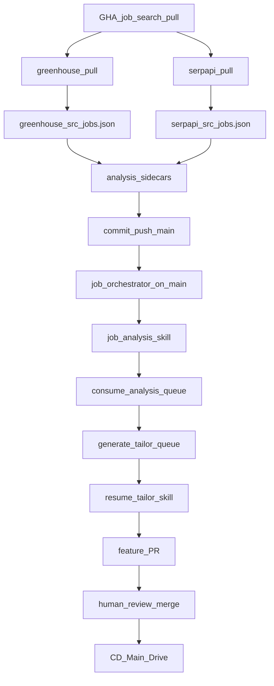


Scheduled GitHub Action runs two ingest pipelines in parallel (Greenhouse ATS boards + SerpApi Google Jobs), writes dated `jobs.json` + analysis stubs, and commits to `main`. The orchestrator agent drains analysis and tailor queues, opens per-job resume tailor PRs, then stops. Human PR merge triggers a deploy to Google Drive.

### Orchestrator (normal run)

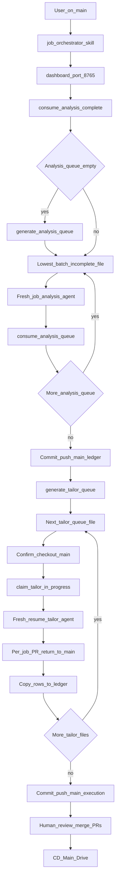


**Entry:** Launch a fresh Agent and invoke `/job-orchestrator`. The orchestrator agent will launch the dashboard if it is not already running, then consume any leftover analysis queue files. It then generates fresh queue file(s) based on job status. Within the same context window, launches a fresh analysis subagent per queue file. Analysis agent consumes each queue file and provides qualification analysis based on locked profile data. When a queue file is complete, reports file, job_id and status back to the orchestrator, who is the sole writer for `approved-jobs.json`. Once analysis queues have been processed entirely, orchestrator consumes the queue and updates the approved jobs ledger. After updating the ledger, orchestrator builds the resume tailor agent queue file(s) from approved jobs. Then launches a fresh resume tailor subagent per approved job. The resume tailor agent consumes the job analysis data (from the analysis agent) and builds the custom tailored artifacts (run log, tailored resume docx, compensation target and tailored outreach) on a feature branch. Upon completion, opens PR targeting `main` and checks out `main` to continue to the next job. Process continues until all approved jobs have PR's. Orchestrator updates the ledger status one last time and validates PR's are ready for review before completing a run. Upon human review and merge, github action deploys tailored artifacts to google drive completing the end-to-end process.

Internal script sequence: `[.cursor/skills/job-orchestrator/SKILL.md](.cursor/skills/job-orchestrator/SKILL.md)`.

### Resume fill and deploy

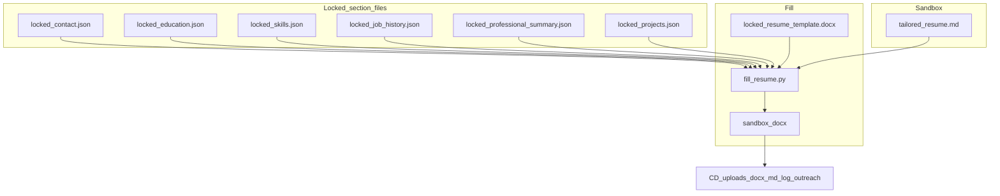


`fill_resume.py` opens `locked-resume-template.docx` and fills the placeholder tags from source object.field(s). It utilizes `resume-data-model.json` as source for fill mapping. The number of skills that get mapped into the tailored resume is determined by the number of placeholder tags listed in the template as well as the number of selected skills by the agent. Empty tags are removed before minting the fill.

`derive_template.py` can be utilized / modified to generate an initial template file (from an external source), then customized in Microsoft Word.

---

## Operator entry points


| Work                                                                      | Entry                                                                                                                                 |
| ------------------------------------------------------------------------- | ------------------------------------------------------------------------------------------------------------------------------------- |
| Normal run after scheduled pull                                           | Starting on `main`, invoke `/job-orchestrator`                                                                                        |
| Ingest both pipelines (merge or rebuild)                                  | GitHub → Actions → **Job Search Pull** → `platform=all` (see [Data ingestion](#data-ingestion-pipelines))                             |
| Ingest Greenhouse only                                                    | Same workflow → `platform=greenhouse`                                                                                                 |
| Ingest SerpApi only                                                       | Same workflow → `platform=serpapi`                                                                                                    |
| Rebuild today UTC                                                         | Same workflow → `rebuild=true` (today UTC only)                                                                                       |
| Single custom resume without the orchestrator                             | See Manual resume-tailor section below                                                                                                |
| Single orchestrator run on a single `job_id` after adding locked evidence | Starting on `main`, invoke `/job-orchestrator` on `job_id`                                                                            |
| Single analysis agent run on a single `job_id` (re-analyze)               | Starting on `main` run python .github/scripts/job-search/common/generate-analysis-queue.py --job-id {id}, then invoke `/job-analysis` |
| Discover new Greenhouse board tokens (local)                              | Run `.\.ai\history\job-search\greenhouse\discover-boards.ps1` (see [Greenhouse board discovery](#greenhouse-board-token-discovery-local)) |


Local dashboard (orchestrator starts it if port 8765 is closed):

macOS / Git Bash:

```bash
./.ai/history/job-search/dashboard/serve-dashboard.sh
```

Windows PowerShell:

```powershell
powershell -ExecutionPolicy Bypass -File .\.ai\history\job-search\dashboard\serve-dashboard.ps1
```

Open `http://127.0.0.1:8765/dashboard/`. Both launchers run `serve.py`.

Stop a running dashboard. If it is in the foreground of this terminal, `Ctrl+C`. If the orchestrator (or another session) left it listening on 8765:

macOS / Git Bash:

```bash
kill $(lsof -t -iTCP:8765 -sTCP:LISTEN)
```

Windows PowerShell:

```powershell
Get-NetTCPConnection -LocalPort 8765 -State Listen -ErrorAction SilentlyContinue |
  ForEach-Object { Stop-Process -Id $_.OwningProcess -Force }
```

---

## Manual workflows

Each runbook lists entry commands, guardrails, and stop conditions. Follow the linked skill for internal steps.

### Data ingestion pipelines

Three compartmentalized ingest pipelines feed dated `jobs.json` under `.ai/history/job-search/` (ADR-040/041/043). Greenhouse and SerpApi are driven by `[.github/workflows/job-search-pull.yml](.github/workflows/job-search-pull.yml)` (daily `0 7 * * *` UTC and `workflow_dispatch` on `main` only). **TalentBrew is a third, local-authoritative ingest** (Windows scheduled task at 08:00 UTC). Do not fold it into the Greenhouse “local script is debug only” rule.


| Pipeline                  | Criteria                                                                                         | Catalog / config                                                                                    | Output                                                                                                                       |
| ------------------------- | ------------------------------------------------------------------------------------------------ | --------------------------------------------------------------------------------------------------- | ---------------------------------------------------------------------------------------------------------------------------- |
| **Greenhouse**            | `jsc_001` in `[locked-job-search-criteria.json](.ai/guardrails/locked-job-search-criteria.json)` | Enabled `ats.platform=greenhouse` rows in `[companies.json](.ai/history/job-search/companies.json)` | `.ai/history/job-search/greenhouse/src/{date}/jobs.json` + sidecars under `greenhouse/analyses/`                             |
| **SerpApi (Google Jobs)** | `jsc_002` in the same criteria file                                                              | `SERPAPI_API_KEY` (Environment `production`); `jsc_002.max_searches` caps billed searches/day        | `.ai/history/job-search/serpapi/src/{date}/jobs.json` + sidecars under `serpapi/analyses/` (skipped on quota stop / no file) |
| **TalentBrew (local)**    | `jsc_003` in the same criteria file                                                              | Enabled `company` slot rows in `[companies.json](.ai/history/job-search/companies.json)` (Capital One) | `.ai/history/job-search/talentbrew/src/{date}/jobs.json` + sidecars under `talentbrew/analyses/` (Windows Task Scheduler, not GHA) |


#### Execution flow (coordinated)

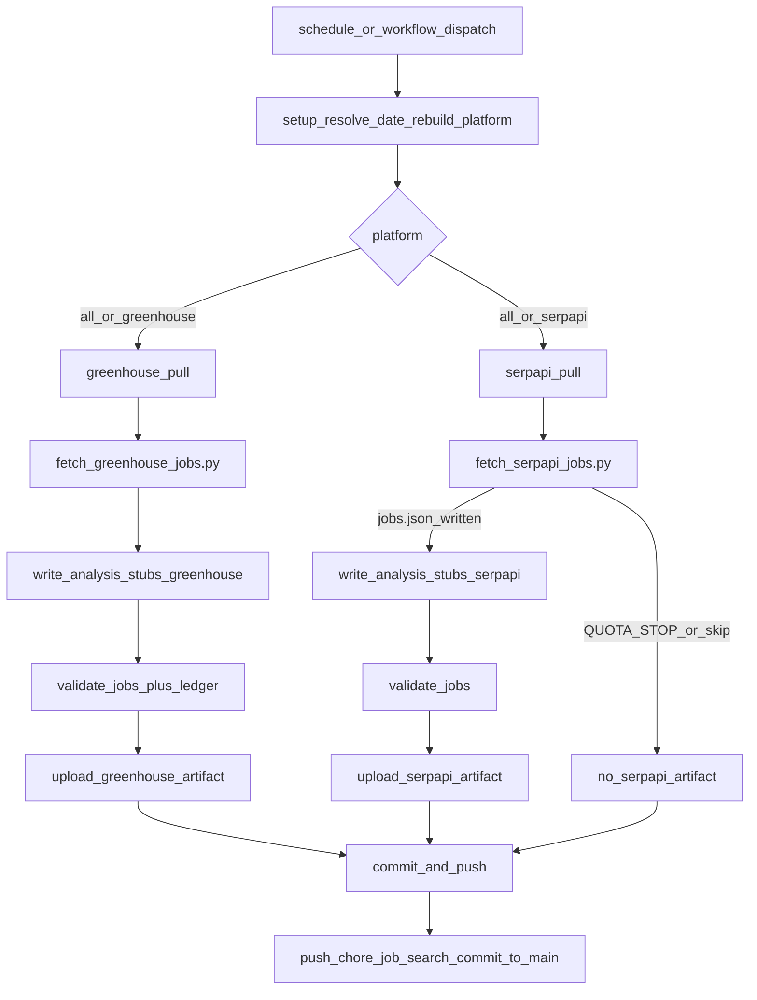


`platform=all` (default on schedule) runs Greenhouse and SerpApi in parallel. `commit-and-push` merges whichever artifacts succeeded; SerpApi skip/fail does not block a successful Greenhouse commit.

#### Greenhouse flow

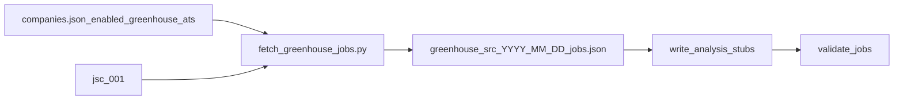


#### SerpApi flow

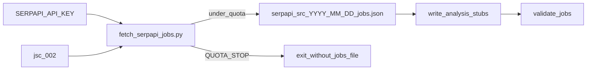


#### Manual run (authoritative): GitHub Actions

1. Ensure `main` is current and criteria / `companies.json` are committed as you want them.
2. GitHub → **Actions** → **Job Search Pull** → **Run workflow**.
3. Branch: `main` only.
4. Inputs:
  - `date` — leave blank for today UTC, or set `YYYY-MM-DD` (not in the past).
  - `rebuild` — `true` only for **today UTC**. Overwrites that day's `jobs.json` (every row `status=new`), wipes matching **pre-handoff** analysis sidecars and `approved` ledger rows; keeps `in_progress` / `failed` / `completed` / `deployed` (ADR-032).
  - `platform` — `all` | `greenhouse` | `serpapi`.
5. Wait for `commit-and-push` to land on `main`, then `git pull origin main` locally before `/job-orchestrator`.

**CLI equivalent** (same workflow, from a machine with `gh`):

```bash
# Both pipelines, merge mode (today UTC)
gh workflow run job-search-pull.yml --ref main -f platform=all -f rebuild=false

# Greenhouse only
gh workflow run job-search-pull.yml --ref main -f platform=greenhouse

# SerpApi only
gh workflow run job-search-pull.yml --ref main -f platform=serpapi

# Rebuild today UTC (both)
gh workflow run job-search-pull.yml --ref main -f platform=all -f rebuild=true

gh run watch
```

#### Manual / local script run (debug only)

Use local Python to exercise fetchers without treating the result as the production commit. Authoritative writes to `main` remain the GitHub Action.

Prerequisites: repo root, venv with `.github/scripts/job-search/common/requirements.txt`, `PYTHONPATH=.github/scripts/job-search`. SerpApi also needs `SERPAPI_API_KEY` in the environment.

```powershell
# Windows PowerShell — Greenhouse merge for today UTC
$env:PYTHONPATH = ".github/scripts/job-search"
python .github/scripts/job-search/greenhouse/fetch_greenhouse_jobs.py
python .github/scripts/job-search/common/write_analysis_stubs.py --platform greenhouse
python .github/scripts/job-search/common/validate_jobs.py ".ai/history/job-search/greenhouse/src/$((Get-Date).ToUniversalTime().ToString('yyyy-MM-dd'))/jobs.json"

# Greenhouse rebuild (today UTC only)
python .github/scripts/job-search/greenhouse/fetch_greenhouse_jobs.py --rebuild
python .github/scripts/job-search/common/write_analysis_stubs.py --platform greenhouse --rebuild
```

```powershell
# SerpApi — dry-run quota / search planning (no write)
$env:SERPAPI_API_KEY = "<from GitHub production secret or local vault>"
python .github/scripts/job-search/serp-api/fetch_serpapi_jobs.py --dry-run

# SerpApi — live pull for today UTC
python .github/scripts/job-search/serp-api/fetch_serpapi_jobs.py
# If jobs.json was written:
python .github/scripts/job-search/common/write_analysis_stubs.py --platform serpapi
python .github/scripts/job-search/common/validate_jobs.py ".ai/history/job-search/serpapi/src/$((Get-Date).ToUniversalTime().ToString('yyyy-MM-dd'))/jobs.json"
```

```bash
# macOS / Git Bash — same pattern
export PYTHONPATH=.github/scripts/job-search
python .github/scripts/job-search/greenhouse/fetch_greenhouse_jobs.py --date "$(date -u +%F)"
python .github/scripts/job-search/common/write_analysis_stubs.py --date "$(date -u +%F)" --platform greenhouse
python .github/scripts/job-search/common/validate_jobs.py ".ai/history/job-search/greenhouse/src/$(date -u +%F)/jobs.json"

export SERPAPI_API_KEY=...
python .github/scripts/job-search/serp-api/fetch_serpapi_jobs.py --date "$(date -u +%F)"
```

**Stop:** Do not use local Greenhouse/SerpApi `pull-jobs.ps1 -Rebuild` (or a local commit/push of those pull artifacts) as the authoritative path. Do not dispatch rebuild for a past date. Do not invent `SERPAPI_API_KEY` into the repo. After a local Greenhouse/SerpApi debug pull, prefer discarding uncommitted ingest files or re-running the Action so `main` stays the source of truth.

#### TalentBrew flow (local authoritative)

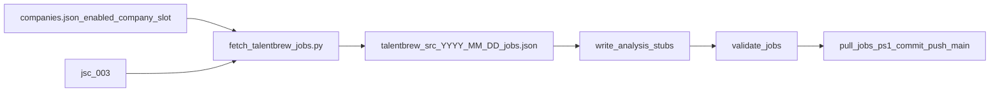

Scheduled task `JobForge-TalentBrew-Pull` runs daily **08:00 UTC** (04:00 EDT / 03:00 EST) after GHA `0 7 * * *`. Sleep or a powered-off machine can skip 08:00 UTC. `StartWhenAvailable` runs after the next boot if the window was missed; `WakeToRun` is best-effort wake from sleep.

Confirm today’s pull: `.ai/history/job-search/talentbrew/src/{YYYY-MM-DD}/jobs.json` for **today UTC**.

**Manual execution** (authoritative for TalentBrew when the task did not run):

```powershell
cd <repo-root>
git checkout main
git pull --ff-only origin main
.\.ai\history\job-search\talentbrew\pull-jobs.ps1
```

Then `git pull origin main` if needed and invoke `/job-orchestrator` when analysis/tailor should follow (same as after GHA ingest).

Inspect last run: Task Scheduler → `JobForge-TalentBrew-Pull` → Last Run Time / Last Run Result.

Register or re-register after a repo path change: `.\scripts\set-up-scripts\register-talentbrew-pull-task.ps1`.

#### Greenhouse board token discovery (local)

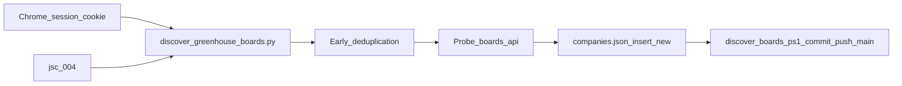

Discover new Greenhouse company board tokens by querying `my.greenhouse.io` via an authenticated candidate session using search chips defined in `jsc_004` (ADR-054).

- **Authentication options:**
  1. **Gitignored Auth File (`.auth/greenhouse_session.txt` — Recommended):** Copy the `_session_id` cookie value from Chrome (`F12` → **Application** → **Cookies** → `https://my.greenhouse.io`) and save it to `.auth\greenhouse_session.txt`.
  2. **CLI Parameter:** Pass `-SessionCookie "YOUR_COOKIE"` to `discover-boards.ps1`.
  3. **Environment Variable:** Set `$env:GREENHOUSE_SESSION_COOKIE = "YOUR_COOKIE"`.
  4. **Automatic Chrome Extraction:** Scrapes the cookie from Google Chrome (Default profile) using native Windows DPAPI + AES-GCM via `ctypes`. *(Note: Chrome 127+ uses App-Bound Encryption and locks open files, so methods 1–3 are preferred when Chrome is open).*
- **Early Deduplication:** Discovered companies and board tokens are checked against `companies.json`. Existing entries are skipped to prevent mutating existing rows.
- **Public Reachability Probe:** Pre-flights `GET boards-api.greenhouse.io/v1/boards/{token}/jobs`. Reachable boards are inserted with `ats.enabled=true`; unreachable ones are inserted with `ats.enabled=false`.
- **Downstream Pull:** On the next scheduled Greenhouse pull (`fetch_greenhouse_jobs.py` / GHA), newly enabled boards are automatically queried and filtered against `jsc_001`.

**Session Cookie Setup (One-time or when session expires):**

1. In Chrome, log into `https://my.greenhouse.io`
2. Press `F12` → **Application** tab → **Cookies** → `https://my.greenhouse.io`
3. Copy the **Value** of `_session_id` (or copy the entire table row / full cookie string)
4. Save to `.auth\greenhouse_session.txt` (gitignored):
   ```powershell
   New-Item -ItemType Directory -Force -Path .auth
   Set-Content -Path .auth\greenhouse_session.txt -Value "YOUR_COPIED_COOKIE_VALUE"
   ```

**Manual execution:**

```powershell
cd <repo-root>
git checkout main
git pull --ff-only origin main
.\.ai\history\job-search\greenhouse\discover-boards.ps1
```

**Common options:**

```powershell
# Dry run (probe and display discovered boards without modifying companies.json or committing)
.\.ai\history\job-search\greenhouse\discover-boards.ps1 -DryRun

# Provide session cookie explicitly on the CLI
.\.ai\history\job-search\greenhouse\discover-boards.ps1 -SessionCookie "YOUR_COPIED_COOKIE_VALUE"

# Set session cookie via environment variable
$env:GREENHOUSE_SESSION_COOKIE = "YOUR_COPIED_COOKIE_VALUE"
.\.ai\history\job-search\greenhouse\discover-boards.ps1

# Modify companies.json but skip git commit and push
.\.ai\history\job-search\greenhouse\discover-boards.ps1 -SkipGit
```

**Direct Python CLI invocation (debug):**

```powershell
$env:PYTHONPATH = ".github/scripts/job-search"
python .github/scripts/job-search/greenhouse/discover_greenhouse_boards.py --dry-run
python .github/scripts/job-search/greenhouse/discover_greenhouse_boards.py
```

Register or re-register scheduled task: `.\scripts\set-up-scripts\register-greenhouse-discover-task.ps1`.

### Manual resume-tailor

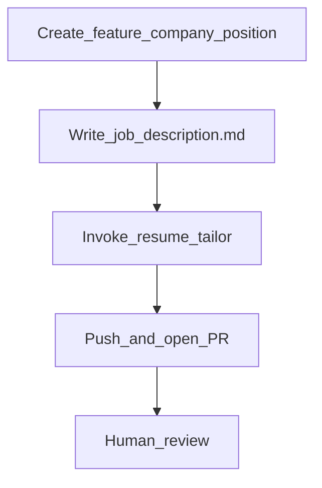


**Prerequisites:** Matching `feature/{company}-{position}` already checked out, `job-description.md` populated.

```bash
git checkout -b feature/{company}-{position}
```

macOS / Git Bash:

```bash
mkdir -p .ai/history/resume-tailor/{company}/{position}
touch .ai/history/resume-tailor/{company}/{position}/job-description.md
```

Windows PowerShell:

```powershell
New-Item -ItemType File -Force -Path .ai/history/resume-tailor/{company}/{position}/job-description.md
```

Populate `job-description.md`

**Entry:** Starting on feature branch, invoke `/resume-tailor` on .ai/history/resume-tailor/{company}/{position}/job-description.md

"/resume-tailor on .ai/history/resume-tailor/{company}/{position}/job-description.md"

Once you are ready, approve the pr and GitHub actions will execute the ci/cd pipeline merging all files into `main` and deploy the artifacts to your preferred sharing location (e.g. google drive). 

Switch back to `main`

```bash
git checkout main
```

Run a `pull` to get the merged files

```bash
git pull origin main
```

Delete your local feature branch

```bash
git branch -d feature/your-branch-name
```

Prune the stale remote branch tracking history

```bash
git fetch --prune
```

### Single job re-analysis

After you edit locked evidence for one `job_id`.

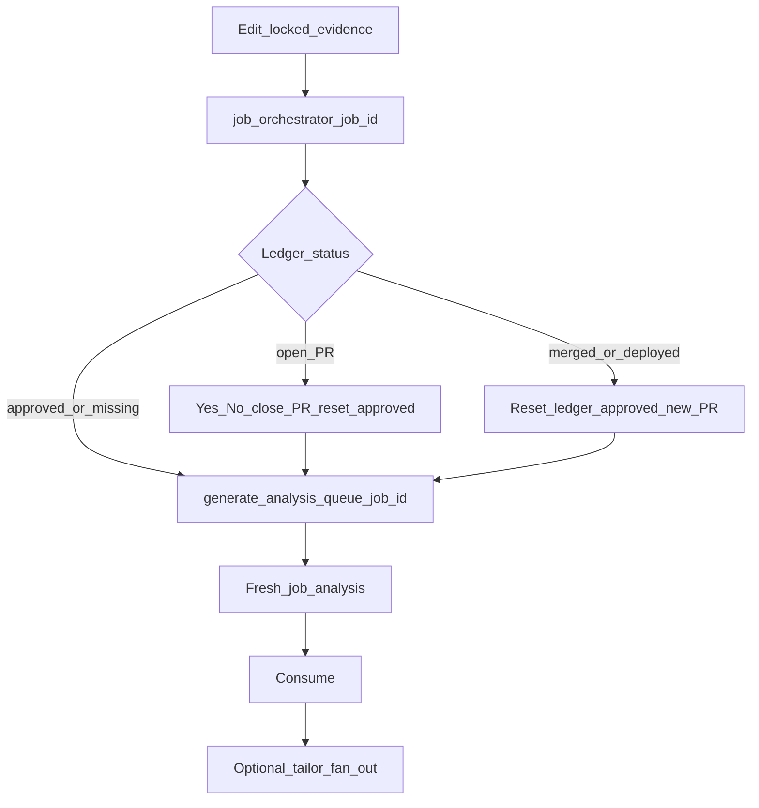


**Entry:** On `main`, invoke `/job-orchestrator` with the `job_id`. Do not mint leftover analysis queues first. Orchestrator uses:

```bash
python .github/scripts/job-search/common/generate-analysis-queue.py --job-id {id}
```

Do not pass `--invoke manual` (default = `batch`).

**Stop:** Agents do not write `.ai/guardrails/`. Open-PR path asks Yes/No before closing an open PR if it exists. Merge + deploy overwrites the sandbox via a new feature PR; it does not force-push `main`.

### Manual orchestrator

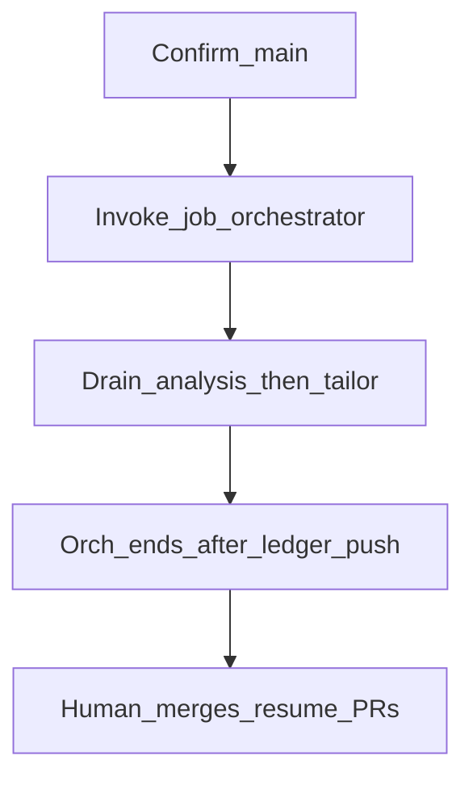


**Prerequisites:** `main`, clean enough to commit job-search ledger paths, `gh` authenticated, Python venv active.

**Entry:** Invoke `/job-orchestrator` with no `job_id`.

**Stop:** Orchestrator does not merge resume PRs, does not create tailor feature branches itself, and does not stage `{company}/{position}/` on `main`. After it reports, you review PRs, merge, delete feature branches, prune, and stay on `main`.

---

## Resume rendering

After `tailored-resume.md` exists in a sandbox:

```bash
python scripts/resume-docx/fill_resume.py --sandbox .ai/history/resume-tailor/{company}/{position}
```

Requires `python-docx` and `lxml` from `scripts/resume-docx/requirements.txt`. Output: `John_Doe_Resume_{Company_Title_Case}.docx`.

---

## CI and CD


| Workflow                                                                         | Trigger                                              | Purpose                                                                                                                                                         |
| -------------------------------------------------------------------------------- | ---------------------------------------------------- | --------------------------------------------------------------------------------------------------------------------------------------------------------------- |
| `[.github/workflows/ci.yml](.github/workflows/ci.yml)`                           | PR to `main`, push to non-`main`                     | Guardrail JSON, resume-tailor files, chronology, `validate` check                                                                                               |
| `[.github/workflows/cd-main.yml](.github/workflows/cd-main.yml)`                 | Push to `main`                                       | Re-validate, stage five artifacts + manifest (resume md/docx, cover letter docx, engineering-log, outreach), Drive sync (`production`)                                                                                         |
| `[.github/workflows/job-search-pull.yml](.github/workflows/job-search-pull.yml)` | Daily `0 7 * * *` UTC, `workflow_dispatch` on `main` | Parallel greenhouse + serpapi pull (ADR-040/041); SerpApi uses `SERPAPI_API_KEY` in Environment `production`; `QUOTA_STOP`/skip leaves Greenhouse commit intact |


CI checks when a sandbox changes: `job-description.md`, `engineering-log.md`, `tailored-resume.md`, `tailored-outreach.md`, `John_Doe_Resume_*.docx` with no leftover `{{`. Role `##` headers in `tailored-resume.md` must match `locked-resume-master-template.md` in order (stop at `## Skills`).

Local:

```bash
python scripts/ci/validate_guardrails_json.py
python scripts/ci/validate_resume_tailor_artifacts.py --base origin/main
python scripts/ci/build_resume_tailor_manifest.py --base HEAD~1 --commit-sha HEAD
```

Python version for Actions is `[.python-version](.python-version)`.

---

## Source of truth


| Topic                 | File                                                                  |
| --------------------- | --------------------------------------------------------------------- |
| Identity join         | `.ai/history/architectural-decisions/resume-data-model.json`          |
| Decisions             | `.ai/history/architectural-decisions/architectural-decision-log.json` |
| Directory and toolkit | `.cursor/rules/core-architecture.mdc`                                 |
| Execution limits      | `.cursor/rules/execution-constraints.mdc`                             |
| Resume markdown style | `.cursor/rules/formatting-rules.mdc`                                  |
| Project guardrails    | `.cursor/rules/project-context.mdc`                                   |


The README directory map is rebuilt by the pre-commit hook when staged paths are added, deleted, or renamed. Specific directories are ignored to reduce clutter. Manual rebuild:

macOS / Git Bash:

```bash
.git/hooks/pre-commit --force
```

Windows PowerShell:

```powershell
& .git\hooks\pre-commit.ps1 -Force
```

If Windows PowerShell blocks the wrapper:

```powershell
Set-ExecutionPolicy -ExecutionPolicy RemoteSigned -Scope Process
```

---

<details>
<summary>Workspace directory map</summary>
<!-- START_DIRECTORY_MAP -->
## Workspace Architecture & Directory Map

- `/.ai/` -> Framework configs, locked identity, and pipeline history
    - `/.ai/guardrails/` -> Human-maintained identity, schemas, and policies
        - `/.ai/guardrails/job-history-scratchpad.md` -> Owner scratch notes; not a locked instance file
        - `/.ai/guardrails/locked-agent-policies.json` -> Named agent policies (not identity)
        - `/.ai/guardrails/locked-certifications.json` -> Optional certifications envelope
        - `/.ai/guardrails/locked-clearance.json` -> Optional clearance envelope
        - `/.ai/guardrails/locked-contact.json` -> Identity and child foreign keys
        - `/.ai/guardrails/locked-cover-letter-template.docx` -> Word layout and {{TOKENS}}
        - `/.ai/guardrails/locked-cover-letter-template.md` -> Cover letter heading and section schema
        - `/.ai/guardrails/locked-education.json` -> Education facts
        - `/.ai/guardrails/locked-job-data-model.json` -> Job-search JSON schema (not identity)
        - `/.ai/guardrails/locked-job-history.json` -> Locked roles, dates, and accomplishments
        - `/.ai/guardrails/locked-job-search-criteria.json` -> Multi-id criteria envelope
        - `/.ai/guardrails/locked-job-search-data-model.json` -> Job-search JSON schema
        - `/.ai/guardrails/locked-licenses.json` -> Optional licenses envelope
        - `/.ai/guardrails/locked-linkedin-profile-template.md` -> Unused by current skills
        - `/.ai/guardrails/locked-professional-summary.json` -> Target focus and summary text
        - `/.ai/guardrails/locked-projects.json` -> Optional projects envelope
        - `/.ai/guardrails/locked-resume-master-template.md` -> Chronology source of truth
        - `/.ai/guardrails/locked-resume-template.docx` -> Word layout and {{TOKENS}}
        - `/.ai/guardrails/locked-skills.json` -> Selected and all locked skills
    - `/.ai/history/` -> Pipeline sandboxes and architectural records
        - `/.ai/history/architectural-decisions/` -> ADRs and data-model contracts
            - `/.ai/history/architectural-decisions/architectural-decision-log.json` -> ADR records
            - `/.ai/history/architectural-decisions/cover-letter-data-model.json` -> Cover-letter fill join contract
            - `/.ai/history/architectural-decisions/job-data-model.json` -> Job-search instance model documentation
            - `/.ai/history/architectural-decisions/resume-data-model.json` -> Identity join for resume fill
        - `/.ai/history/defects/` -> Defect records
        - `/.ai/history/job-search/` -> Job-search ledger, dashboard, and queues
        - `/.ai/history/orchestrator/` -> Orchestrator run-log directory
            - `/.ai/history/orchestrator/.gitkeep` -> Keep empty run-log directory in git
        - `/.ai/history/resume-tailor/` -> Per-job tailor sandboxes and gitignored queue
- `/.cursor/` -> Cursor rules, skills, and plans
    - `/.cursor/rules/` -> Immutable agent rules
        - `/.cursor/rules/core-architecture.mdc` -> Directory structure and toolkit
        - `/.cursor/rules/execution-constraints.mdc` -> Safety, cost, and file-operation limits
        - `/.cursor/rules/formatting-rules.mdc` -> Resume markdown formatting
        - `/.cursor/rules/project-context.mdc` -> Objective and locked-history guardrails
    - `/.cursor/skills/` -> Human-maintained agent workflows
        - `/.cursor/skills/grill-me/` -> Planning interview skill
            - `/.cursor/skills/grill-me/SKILL.md` -> Planning interview workflow
        - `/.cursor/skills/job-analysis/` -> Job qualification skill
            - `/.cursor/skills/job-analysis/SKILL.md` -> Qualification workflow
        - `/.cursor/skills/job-orchestrator/` -> Local analysis and tailor coordinator
            - `/.cursor/skills/job-orchestrator/SKILL.md` -> Analysis and tailor coordinator workflow
        - `/.cursor/skills/resume-tailor/` -> Resume tailoring skill
            - `/.cursor/skills/resume-tailor/SKILL.md` -> Resume and cover-letter tailoring workflow
- `/.github/` -> CI/CD workflows and pipeline scripts
    - `/.github/scripts/` -> GitHub-side Python helpers
        - `/.github/scripts/job-search/` -> Compartmentalized ingest scripts
            - `/.github/scripts/job-search/common/` -> Shared validators, queues, stubs, ledger helpers
                - `/.github/scripts/job-search/common/__init__.py` -> Package marker for common helpers
                - `/.github/scripts/job-search/common/agent_policy.py` -> Load a policy record from locked-agent-policies.json by id
                - `/.github/scripts/job-search/common/claim_tailor_in_progress.py` -> Claim pending tailor-queue rows as in_progress on the ledger (local; no push)
                - `/.github/scripts/job-search/common/clock.py` -> UTC clock helpers for pull and stub writers
                - `/.github/scripts/job-search/common/consume_analysis_queue.py` -> Consume analysis_complete rows into approved-jobs.json
                - `/.github/scripts/job-search/common/consume_tailor_queue.py` -> Consume tailor terminal rows into approved-jobs.json (drains completed rows)
                - `/.github/scripts/job-search/common/generate-analysis-queue.py` -> Mint per-platform analysis-request files from every sandbox with src/
                - `/.github/scripts/job-search/common/orch_run_log.py` -> Truncate/append orchestrator run.log and rewrite telemetry trailer
                - `/.github/scripts/job-search/common/purge_dated_src.py` -> Delete dated src folders older than today UTC minus 30 days
                - `/.github/scripts/job-search/common/requirements.txt` -> Job-search Python deps (jsonschema, pytest)
                - `/.github/scripts/job-search/common/tests/` -> Pytest suite for common helpers (catalog, queues, ledger, validators)
                - `/.github/scripts/job-search/common/validate_analysis_request.py` -> Fail-closed validation of analysis-request queue files
                - `/.github/scripts/job-search/common/validate_job_search.py` -> Path-selected fail-closed validation of job-search instance files
                - `/.github/scripts/job-search/common/validate_jobs.py` -> Jobs.json-only wrapper around validate_job_search (no sidecars required)
                - `/.github/scripts/job-search/common/write_analysis_stubs.py` -> Create pull-time analysis stubs and missing approved-jobs.json envelope
            - `/.github/scripts/job-search/greenhouse/` -> Greenhouse fetch, discovery, and normalize
                - `/.github/scripts/job-search/greenhouse/__init__.py` -> Package marker for greenhouse puller
                - `/.github/scripts/job-search/greenhouse/chrome_cookie.py` -> Windows Chrome DPAPI + AES-GCM cookie extractor (ctypes)
                - `/.github/scripts/job-search/greenhouse/discover_greenhouse_boards.py` -> Discover Greenhouse board tokens from MyGreenhouse Inertia and upsert new companies
                - `/.github/scripts/job-search/greenhouse/fetch_greenhouse_jobs.py` -> Fetch boards from companies.json, filter by jsc_001, write dated jobs.json
                - `/.github/scripts/job-search/greenhouse/normalize.py` -> Map Greenhouse Job Board API payloads to the locked job-search model
                - `/.github/scripts/job-search/greenhouse/tests/` -> Pytest suite for greenhouse fetch/normalize/discovery
            - `/.github/scripts/job-search/pytest.ini` -> Pytest config (pythonpath=.; testpaths=common, greenhouse, serp-api)
            - `/.github/scripts/job-search/serp-api/` -> SerpApi Google Jobs puller (jsc_002, quota gates, max_searches from criteria)
                - `/.github/scripts/job-search/serp-api/__init__.py` -> Package marker for serp-api puller
                - `/.github/scripts/job-search/serp-api/fetch_serpapi_jobs.py` -> Fetch Google Jobs via SerpApi with quota gates; write dated jobs.json or skip
                - `/.github/scripts/job-search/serp-api/normalize_serpapi.py` -> Normalize SerpApi payloads to the locked job-search model
                - `/.github/scripts/job-search/serp-api/tests/` -> Pytest suite for serp-api fetch/normalize/quota
            - `/.github/scripts/job-search/talentbrew/` -> TalentBrew fetch and normalize
                - `/.github/scripts/job-search/talentbrew/__init__.py` -> Package marker for talentbrew puller
                - `/.github/scripts/job-search/talentbrew/fetch_talentbrew_jobs.py` -> Fetch company-slot jobs, filter, write dated jobs.json
                - `/.github/scripts/job-search/talentbrew/normalize.py` -> Map TalentBrew HTML to the locked job-search model
                - `/.github/scripts/job-search/talentbrew/tests/` -> Pytest suite for talentbrew fetch/normalize
        - `/.github/scripts/resume-tailor/` -> Tailor-queue helpers
            - `/.github/scripts/resume-tailor/generate-tailor-queue.py` -> Mint per-platform tailor-request files from every sandbox with src/
            - `/.github/scripts/resume-tailor/tests/` -> Tailor-queue pytest suite (files omitted)
            - `/.github/scripts/resume-tailor/upsert_engineering_log.py` -> Mint engineering-log.md sections 1-3 from queue row
            - `/.github/scripts/resume-tailor/upsert_job_description.py` -> Mint job-description.md and job-id.txt from queue row
            - `/.github/scripts/resume-tailor/validate_tailor_request.py` -> Tailor queue schema check
    - `/.github/workflows/` -> GitHub Actions
        - `/.github/workflows/cd-main.yml` -> Main-branch Drive deploy
        - `/.github/workflows/ci.yml` -> PR and branch validation
        - `/.github/workflows/job-search-pull.yml` -> Coordinated greenhouse + serpapi pull, one commit to main
- `/.gitignore` -> Ignored queues, venv, dist, and run.log
- `/.python-version` -> Shared Python version for local venv and Actions
- `/README.md` -> Owner-operator manual
- `/scripts/` -> Local CI, DOCX fill, and hook sources
    - `/scripts/ci/` -> Guardrail validators, manifest, and Drive sync
        - `/scripts/ci/build_resume_tailor_manifest.py` -> Stage five deploy artifacts and manifest
        - `/scripts/ci/common.py` -> Shared path and kebab_case helpers
        - `/scripts/ci/obtain_gdrive_oauth_token.py` -> Desktop OAuth refresh-token helper
        - `/scripts/ci/requirements.txt` -> CI Python deps
        - `/scripts/ci/stamp_deployed_ledger.py` -> Mark ledger rows deployed after Drive upload
        - `/scripts/ci/sync_gdrive.py` -> Upload sandbox artifacts to Drive
        - `/scripts/ci/tests/` -> CI helper pytest suite (files omitted)
        - `/scripts/ci/validate_guardrails_json.py` -> Locked JSON schema check
        - `/scripts/ci/validate_resume_tailor_artifacts.py` -> Sandbox completeness and chronology
    - `/scripts/cover-letter-docx/` -> Word template fill
        - `/scripts/cover-letter-docx/derive_cover_letter_template.py` -> One-time sample-to-token derivation
        - `/scripts/cover-letter-docx/fill_cover_letter.py` -> Fill sandbox DOCX from tailored-cover-letter.md
        - `/scripts/cover-letter-docx/requirements.txt` -> python-docx and lxml
        - `/scripts/cover-letter-docx/tests/` -> Pytest suite for cover-letter fill
    - `/scripts/resume-docx/` -> Word template fill
        - `/scripts/resume-docx/derive_template.py` -> One-time sample-to-token derivation
        - `/scripts/resume-docx/fill_resume.py` -> Fill sandbox DOCX from locked objects
        - `/scripts/resume-docx/page_fill.py` -> Advisory last-page fill estimator (ADR-051)
        - `/scripts/resume-docx/requirements.txt` -> python-docx and lxml
        - `/scripts/resume-docx/tests/` -> Pytest suite for resume fill
    - `/scripts/set-up-scripts/` -> Canonical Git hook sources and local scheduled task registrars
        - `/scripts/set-up-scripts/install-hooks.sh` -> POSIX installer that copies hook files into .git/hooks
        - `/scripts/set-up-scripts/pre-commit` -> Canonical POSIX README directory-map rebuild
        - `/scripts/set-up-scripts/pre-commit-update-script.ps1` -> Copies canonical hook files into .git/hooks
        - `/scripts/set-up-scripts/pre-commit.ps1` -> Thin PowerShell wrapper that invokes the POSIX hook
        - `/scripts/set-up-scripts/register-greenhouse-discover-task.ps1` -> Idempotent task registrar for JobForge-Greenhouse-Discover
        - `/scripts/set-up-scripts/register-talentbrew-pull-task.ps1` -> Idempotent task registrar for JobForge-TalentBrew-Pull
- `/setup.md` -> macOS and Windows bootstrap and locked identity fill

<!-- END_DIRECTORY_MAP -->
</details>

